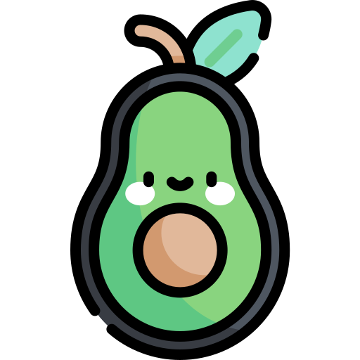

<a name="readme-top"></a>

[![MIT License][license-shield]][license-url]


<!-- PROJECT LOGO -->
<br />
<div align="center">
  <a href="https://github.com/bjvalmaseda-dev/avocado-nextjs">
    
  </a>

<h3 align="center">Avocado Store</h3>

  <p align="center">
    An Avocados web store
    <br />
    <a href="https://github.com/bjvalmaseda-dev/avocado-nextjs"><strong>Explore the docs »</strong></a>
    <br />
    <br />
    <a href="https://avocado-store.bjvalmaseda.xyz">View Demo</a>
    ·
    <a href="https://github.com/bjvalmaseda-dev/avocado-nextjs/issues">Report Bug</a>
    ·
    <a href="https://github.com/bjvalmaseda-dev/avocado-nextjs/issues">Request Feature</a>
  </p>
</div>


<!-- TABLE OF CONTENTS -->
<details>
  <summary>Table of Contents</summary>
  <ol>
    <li>
      <a href="#about-the-project">About The Project</a>
      <ul>
        <li><a href="#built-with">Built With</a></li>
      </ul>
    </li>
    <li>
      <a href="#getting-started">Getting Started</a>
      <ul>
        <li><a href="#prerequisites">Prerequisites</a></li>
        <li><a href="#installation">Installation</a></li>
      </ul>
    </li>
    <li><a href="#contributing">Contributing</a></li>
    <li><a href="#license">License</a></li>
    <li><a href="#contact">Contact</a></li>
  </ol>
</details>


<!-- ABOUT THE PROJECT -->
## About The Project

[![Avocado Store Home Screen Shot][home-screenshot]](https://example.com)
[![Avocado Store Product Screen Shot][product-screenshot]](https://example.com)
[![Avocado Store Cart Screen Shot][cart-screenshot]](https://example.com)

The project is an web store app build with [Next JS][Next-url]. You can visualize a product, send to the cart and delete from the cart.
 
*Icons made by [Freepik](https://www.freepik.es/) from [www.flaticon.com](https://www.flaticon.com)*

<p align="right">(<a href="#readme-top">back to top</a>)</p>


### Built With

* [![Next][Next.js]][Next-url]
* [![React][React.js]][React-url]
* [![Semantic UI React][Semantic-UI]][Semantic-UI-url]
<p align="right">(<a href="#readme-top">back to top</a>)</p>


<!-- GETTING STARTED -->
## Getting Started

To get a local copy up and running follow these simple example steps.

### Prerequisites

You must have installed

* NPM
* Yarn

### Installation

1. Clone the repo
   ```sh
   git clone https://github.com/bjvalmaseda-dev/avocado-nextjs.git
   ```
2. Install all dependencies
   ```sh
   yarn
   ```
3. Build and start the local server
   ```sh
   yarn build && yarn start
   ```
To start a development server execute
  ```sh
  yarn dev
  ```

<p align="right">(<a href="#readme-top">back to top</a>)</p>


<!-- CONTRIBUTING -->
## Contributing

Contributions are what make the open source community such an amazing place to learn, inspire, and create. Any contributions you make are **greatly appreciated**.

If you have a suggestion that would make this better, please fork the repo and create a pull request. You can also simply open an issue with the tag "enhancement".
Don't forget to give the project a star! Thanks again!

1. Fork the Project
2. Create your Feature Branch (`git checkout -b feature/AmazingFeature`)
3. Commit your Changes (`git commit -m 'Add some AmazingFeature'`)
4. Push to the Branch (`git push origin feature/AmazingFeature`)
5. Open a Pull Request

<p align="right">(<a href="#readme-top">back to top</a>)</p>


<!-- LICENSE -->
## License

Distributed under the MIT License. See `LICENSE.txt` for more information.

<p align="right">(<a href="#readme-top">back to top</a>)</p>


<!-- CONTACT -->
## Contact

Bárbaro Javier Valmaseda - [@bjvalmaseda](https://twitter.com/bjvalmaseda) - hello@bjvalmaseda.xyz

Project Link: [https://github.com/bjvalmaseda-dev/avocado-nextjs](https://github.com/bjvalmaseda-dev/avocado-nextjs)

<p align="right">(<a href="#readme-top">back to top</a>)</p>


<!-- MARKDOWN LINKS & IMAGES -->
<!-- https://www.markdownguide.org/basic-syntax/#reference-style-links -->

[contributors-url]: https://github.com/bjvalmaseda-dev/avocado-nextjs/graphs/contributors
[issues-url]: https://github.com/bjvalmaseda-dev/avocado-nextjs/issues
[license-shield]: https://img.shields.io/github/license/bjvalmaseda-dev/avocado-nextjs.svg?style=for-the-badge
[license-url]: https://github.com/bjvalmaseda-dev/avocado-nextjs/blob/master/LICENSE.txt
[home-screenshot]: docs/home.png
[product-screenshot]: docs/product.png
[cart-screenshot]: docs/cart.png
[Next.js]: https://img.shields.io/badge/next.js-000000?style=for-the-badge&logo=nextdotjs&logoColor=white
[Next-url]: https://nextjs.org/
[React.js]: https://img.shields.io/badge/React-20232A?style=for-the-badge&logo=react&logoColor=61DAFB
[React-url]: https://reactjs.org/
[Semantic-UI]: https://img.shields.io/badge/Semantic%20UI%20React-222222?style=for-the-badge&logo=semanticuireact&logoColor=35BDB2
[Semantic-UI-url]: https://reactjs.org/